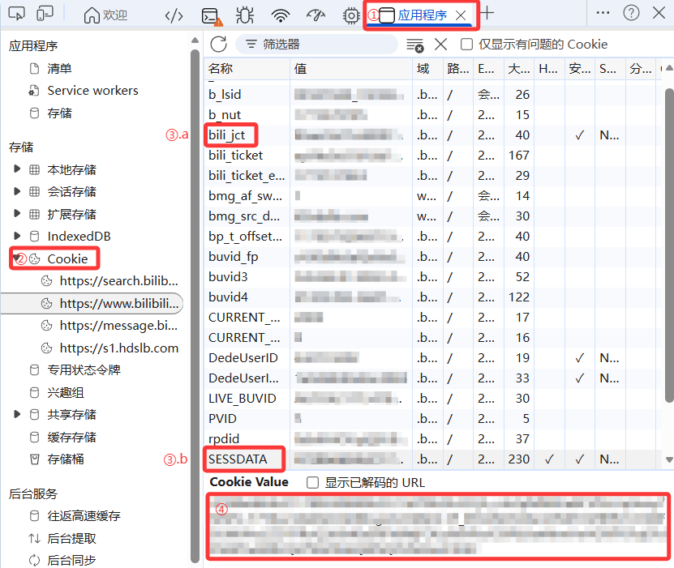

# 准备工作：获取身份凭证

在使用 **弹幕发射器** 之前，你需要获取 Bilibili 账号的身份凭证（Cookie）。程序需要这些凭证来代表你向 B 站服务器发送请求。

!!! danger "安全警告"
    `SESSDATA` 和 `bili_jct` 相当于你的临时账号密码。**请勿将这些信息泄露给他人**。本项目代码完全开源，且所有凭证均通过系统密钥环（Keyring）加密后存储在本地，不会上传至任何第三方服务器。

## 1. 登录 Bilibili
在浏览器（推荐使用 Chrome 或 Edge）中登录你的 B 站账号。

## 2. 打开开发者工具
按下 `F12` 键（或在页面右键点击“检查”），打开开发者工具面板。

## 3. 寻找 Cookie 字段
1. 切换到 **Application** (应用程序) 选项卡。
2. 在左侧菜单中找到 **存储/Storage** -> **Cookie**，并点击 `https://www.bilibili.com`。
3. 在右侧的列表中搜索以下两个键值：

| 键名 | 说明 |
| :--- | :--- |
| `SESSDATA` | 核心登录凭证 |
| `bili_jct` | CSRF 校验令牌 (发送弹幕必须) |

## 4. 填入程序
复制对应的值，回到 **弹幕发射器** 的“全局设置”页面，分别填入对应的输入框。

{ width="500" }