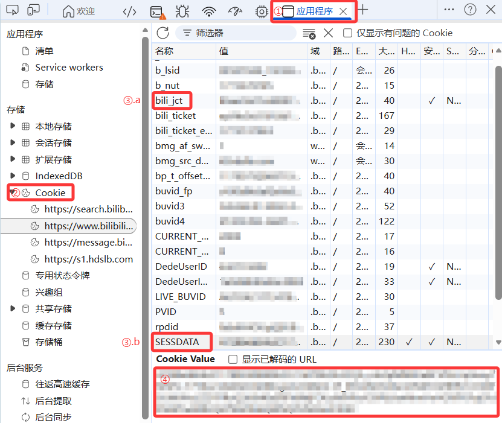

# 登录 B 站账号

在使用 **弹幕发射器** 之前，你需要登录 Bilibili 账号。程序需要你的身份凭证来向 B 站服务器发送请求。

## 方式一：扫码登录（推荐）

点击侧边栏顶部的用户头像区域，打开「账号管理」弹窗，切换到「扫码登录」Tab，用 B 站手机 App 扫描二维码即可。程序会自动获取并保存凭证，无需手动操作。

详见 [账号与安全](../config/account.md)。

---

## 方式二：手动获取凭证

如果扫码登录不可用，可以手动从浏览器中获取凭证：

!!! danger "安全警告"
    `SESSDATA` 和 `bili_jct` 相当于你的临时账号密码。**请勿将这些信息泄露给他人**。本项目代码完全开源，且所有凭证均通过系统密钥环（Keyring）加密后存储在本地，不会上传至任何第三方服务器。

### 第 1 步：登录 Bilibili
在浏览器（推荐使用 Chrome 或 Edge）中登录你的 B 站账号。

### 第 2 步：打开开发者工具
按下 `F12` 键（或在页面右键点击”检查”），打开开发者工具面板。

### 第 3 步：寻找 Cookie 字段
1. 切换到 **Application** (应用程序) 选项卡。
2. 在左侧菜单中找到 **存储/Storage** -> **Cookie**，并点击 `https://www.bilibili.com`。
3. 在右侧的列表中搜索以下两个键值：

| 键名 | 说明 |
| :--- | :--- |
| `SESSDATA` | 核心登录凭证 |
| `bili_jct` | CSRF 校验令牌 |

### 第 4 步：填入程序
复制对应的值，打开「账号管理」弹窗，切换到「手动输入」Tab，分别填入对应的输入框并保存。

{ width=”500” }